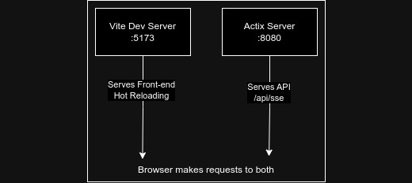
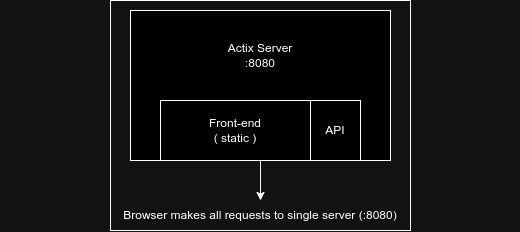

# 🖕 EFS
🖕 EFS, just a rust program that gives a client and a server to get logs.

## Server
Server will serve as the UI and will act as a router for the data coming in from clients, server will expose web sockets for clients to connect and send the live feed, and expose SSE end points for UI users to connect and get the application log.

### Server Architecture
#### In Development

#### In Production
